# Product-Discount-gRPC-Basic-Microservice

<hr/>

Projenin OpenAPI Swagger Dökümanı: http://localhost:8080/swagger-ui/index.html

<hr/>

# Görev 4 : gRPC Entegrasyonu


## Yapılacaklar:

- [x] gRPC kullanılacak.
- [x] gRPC ile parametreli ve parametresiz metotlar yazılacak.

<br/><hr/>

## İçindekiler

1. [gRPC: RPC Framework](#grpc-rpc-framework)
2. [RPC Nedir?](#rpc-nedir)
3. [gRPC Nedir?](#grpc-nedir)
4. [gRPC’nin Temel Özellikleri](#grpcnin-temel-özellikleri)
5. [gRPC Nasıl Çalışır?](#grpc-nasıl-çalışır)  
   
   <details> <summary>Alt Başlıkları Gör</summary>
   
   - [Protocol Buffers (Protobuf)](#1-protocol-buffers-protobuf)
   - [Proto Dosyası](#2-proto-dosyası)
   - [Proto Compiler (protoc)](#3-proto-compiler-protoc)
   - [İstemci ve Sunucu İletişimi](#4-istemci-ve-sunucu-iletişimi)
   - [RPC Patternları](#rpc-patternları)
     - [Unary RPC](#1-unary-rpc)
     - [Server Streaming RPC](#2-server-streaming-rpc)
     - [Client Streaming RPC](#3-client-streaming-rpc)
     - [Bidirectional Streaming RPC](#4-bidirectional-streaming-rpc)
   - [Veri Serileştirme ve Deserileştirme](#5-veri-serileştirme-ve-deserileştirme)
  
   </details>
   
6. [gRPC Yaşam Döngüsü (Lifecycle)](#grpc-yaşam-döngüsü-lifecycle)
7. [HTTP/1 vs HTTP/2](#http1-vs-http2)
   - [HTTP/1.1 ve HTTP/2 Karşılaştırması](#http11-ve-http2-karşılaştırması)
8. [gRPC'nin Avantajları](#grpcnin-avantajları)
9. [gRPC'nin Dezavantajları](#grpcnin-dezavantajları)
10. [Tüm RPC Patternları için Örnek Bir gRPC Proto Dosyası](#tüm-rpc-patternları-için-örnek-bir-grpc-proto-dosyası)
11. [Özet](#özetleyecek-olursak)
12. [Product - Discount gRPC Basic Microservice Tanıtımı](#product---discount-grpc-basic-microservice-tanıtımı)
    - [UML Diyagramları](#uml-diyagramları)
        - [Product Service UML](#product-service-uml)
        - [Discount Service UML](#discount-service-uml)
    - [Uygulamanın Yapısı](#uygulamanın-yapısı)
    - [Proto Dosyasının Derlenmesi ile Oluşan Yapılar](#proto-dosyasının-derlenmesi-ile-oluşan-yapılar)
13. [Uygulama Görüntüleri](#uygulama-görüntüleri)
    - [Konsol Görüntüsü](#konsol-görüntüsü)
    - [Postman Görüntüleri](#postman-görüntüleri)
    - [Swagger Görüntüleri](#swagger-görüntüleri)
14. [Kaynaklar](#kaynaklar)
        
    
## Dökümantasyon

# **gRPC: RPC Framework**

Özellikle mikroservis mimarileri ve dağıtık sistemler günümüzde oldukça yaygın kullanılır. Bu durum sistemlerde esnekliği ve ölçeklenebilirliği arttırmasının yanı sıra dağıtık sistemlerde servisler arası iletişim önemli bir yer tuttuğundan iletişim ve veri iletim hızı için bir dezavantajdır. Bu sorunda geleneksel REST API'ler yaygın bir kullanım alanına sahipken hız konusunda pek yeterli değildir, tam bu noktada gRPC (Google Remote Procedure Call) gibi daha hızlı ve verimli alternatifler de vardır. Bu avatajları büyük ölçüde HTTP/1 yerine HTTP/2 protokülü kullanmasından alır. Bu dökümantasyonda, RPC nedir, gRPC nedirden, gRPC'nin temellerine, çalışma prensiplerine, kullanılan teknolojilere ve gRPC'nin desteklediği RPC pattern'larına kadar çoğu şeyi ele alacağız.

## **RPC Nedir?**

RPC, **Remote Procedure Call** yani “uzak prosedür çağrısı”, isminin de verdiği ipucundan anlaşılacağı üzere bilgisayar ağları üzerinden bir programın başka bir programdaki fonksiyonu yerel bir çağrı yapar gibi çalıştırmasına imkan veren bir yöntemdir. Örneğin, bir istemci uygulaması, sunucu üzerindeki bir fonksiyonu çağırabilir ve sonucu geri alabilir, tıpkı yerel bir fonksiyonu çağırıyormuş gibi. Bu, servisler arası iletişimi kolaylaştırır ve genellikle verimli bir çözüm sunar.

Ancak, RPC'nin kendisi genellikle daha düşük seviyeli bir teknoloji olarak kalır ve onu kullanacak daha gelişmiş sistemlere ihtiyaç duyarız. İşte gRPC, bu noktada devreye girer. Peki bu gRPC nedir?

## **gRPC Nedir?**

"gRPC", Google tarafından geliştirilen açık kaynaklı bir RPC framework’üdür. gRPC, ilk bakışta "Google Remote Procedure Call"  kelimelerinin kısaltması olarak akla gelebilir fakat değil :D başındaki "g" harfi her bir gRPC sürümünü temsil etmektedir ( bkz. [gRPC sürümleri](https://github.com/grpc/grpc/blob/master/doc/g_stands_for.md) ). gRPC, farklı uygulamalar arasında yüksek performanslı iletişimi sağlar. gRPC'nin en önemli avantajlarından biri, **HTTP/2** protokolünü kullanması ve **Protocol Buffers** (Protobuf) adı verilen ve Google tarafından geliştirlmiş ve halen geliştirilen bir veri serileştirme formatı kullanarak çok hızlı veri iletimi sunmasıdır.

gRPC, mikroservis mimarileri ve dağıtık sistemler için tasarlanmış modern bir iletişim çözümüdür. REST API’leri yerine daha verimli ve esnek bir alternatif sunar.

## **gRPC’nin Temel Özellikleri:**
- **HTTP/2 ile Hızlı İletişim**: gRPC, HTTP/2'nin sunduğu avantajları kullanarak daha hızlı veri iletimi sağlar. Bu, paralel isteklerin ve veri sıkıştırmasının mümkün olduğu anlamına gelir.
- **Çoklu Dil Desteği**: gRPC, Java, Python, Go, C++, Ruby gibi birçok popüler programlama dilini destekler. Bu, gRPC’nin farklı platformlarda kullanılabilirliğini artırır.
- **Farklı RPC Modelleri**: gRPC, **Unary**, **Server Streaming**, **Client Streaming** ve **Bidirectional Streaming** gibi farklı RPC türlerini destekler. Bu türler, istemci ve sunucu arasındaki iletişim şekillerini çeşitlendirir.

## **gRPC Nasıl Çalışır?**

gRPC verimli veri aktarımı ve hızlı iletişim sağlamak için birkaç adım/bileşen içerir.

### **1. Protocol Buffers (Protobuf)**
Protocol Buffers, Google tarafından geliştirilmiş bir serileştirme formatıdır. Veri yapılarını tanımlamak ve verileri hızlı bir şekilde serileştirmek/deserileştirmek için kullanılır. JSON veya XML'e göre daha hızlı ve daha küçük boyutludur.

Protobuf'un Avantajları:
- Hafif ve hızlıdır.
- Kolay okunabilir bir şema tanımı (proto dosyası) kullanır.
- Çeşitli programlama dilleriyle uyumludur.

### **2. Proto Dosyası:**

Her şeyin başlangıcı, gRPC’nin temelini oluşturan bir dosya formatıdır: **Proto dosyası**. Proto dosyaları, gRPC servislerinin ve veri yapılarını tanımlamak için kullanılan bir format olup, **Protocol Buffers (Proto)** serileştirme sistemini kullanır. Proto dosyaları, sunucu ve istemci için gerekli sınıfların ve fonksiyonların tanımını içerir.

Bir proto dosyası, genellikle bir **servis** tanımlar ve bu servisin içinde kullanılacak olan **mesaj** yapılarını belirler. İşte basit bir proto dosyasının örneği:

```proto
syntax = "proto3";

service FileService {
  rpc GetFile (FileRequest) returns (FileResponse);
}

message FileRequest {
  string file_name = 1;
}

message FileResponse {
  bytes file_content = 1;
}
```

### **3. Proto Compiler (protoc):**

Proto dosyalarını anlamak ve kullanabilmek için, **Proto Compiler (protoc)** adlı bir araç kullanılır. Bu araç, `.proto` dosyasındaki tanımları alır ve istemci ile sunucu kodlarını üretir. Örneğin, Java için gerekli olan istemci ve sunucu sınıfları oluşturulabilir.

İntelij Idea vb gibi IDE'ler üzerinde bu maven/gradle vs gibi bağımlılık yönetim araçları yardımıyla eklenen pluginler ile sağlanabilirken manuel olarakta oluşturulabilir bunun için yukarıda örnek olarak verilen proto dosyasını derleyen örnek komut:

```bash
protoc --java_out=gen --grpc-java_out=gen FileService.proto
```

### **4. İstemci ve Sunucu İletişimi:**

Proto dosyasını derledikten sonra, istemci ve sunucu arasındaki iletişimi başlatabiliriz. İstemci, bir RPC çağrısı yapmak için ilgili `stub` sınıfını kullanarak gRPC kanalını oluşturur ve istek gönderir. Sunucu ise bu isteği alır, işler ve bir yanıt döner.

#### **RPC Patternları**

gRPC, **Unary**, **Server Streaming**, **Client Streaming** ve **Bidirectional Streaming** olmak üzere dört farklı RPC modelini destekler. Bu modellerin her biri, istemci ve sunucu arasındaki veri akışını farklı şekillerde yönetir. Aşağıda bu konseptin daha iyi anlayabilmemiz için her bir RPC için bir görsel ve açıklamalar bulunuyor.   


#### **`1. Unary RPC`**

Unary RPC, en basit ve en yaygın RPC modelidir. Bir istemci tek bir istek gönderir ve tek bir yanıt alır. Bu, genellikle geleneksel API istekleriyle karşılaştırılabilir.

**Örnek Kullanım**: Bir kullanıcı girişinde kullanıcı bilgilerini doğrulama işlemi.


#### **`2. Server Streaming RPC`**

Server Streaming, istemcinin tek bir istek gönderdiği ve sunucunun birden fazla yanıt gönderdiği modeldir. Bu, veri akışını uzun süreli bir işlem veya büyük veri transferi için kullanışlıdır.

**Örnek Kullanım**: Büyük dosyaların sunucudan istemciye parça parça iletilmesi.


#### **`3. Client Streaming RPC`**

Client Streaming, istemcinin birden fazla istek gönderdiği ve sunucunun tek bir yanıt verdiği modeldir. Bu tür, istemcinin birden fazla veri parçası gönderdiği ancak sadece bir yanıt alması gereken durumlarda kullanılır.

**Örnek Kullanım**: İstemciden gelen birden fazla log kaydını toplama ve analiz etme işlemi.


#### **`4. Bidirectional Streaming RPC`**

Bidirectional Streaming, hem istemcinin hem de sunucunun birden fazla istek ve yanıt gönderebileceği modeldir. Bu tür, her iki tarafın da paralel olarak veri gönderip alabileceği durumlar için uygundur.

**Örnek Kullanım**: Gerçek zamanlı sohbet uygulamaları, video akışı veya canlı veri analizi.


### **5. Veri Serileştirme ve Deserileştirme:**

gRPC'nin hızlı ve etkili olmasının temel nedenlerinden biri, **Protocol Buffers (Protobuf)** kullanarak veri serileştirme ve deserileştirme işlemlerini optimize etmesidir. Bu süreçte, serileştirme işlemi sırasında uygulamanın veri yapıları, Protobuf tanımlarına uygun olarak **ikili (binary)** bir formata dönüştürülür ve HTTP/2 protokolü üzerinden sunucuya iletilir. Sunucu tarafında ise gelen binary veri, Protobuf şemalarına göre deserileştirilerek anlaşılabilir bir veri yapısına dönüştürülür. Sunucu, bu verileri işleyip yanıtı hazırlar ve yanıtı da serileştirerek istemciye geri iletir. Bu serileştirme ve deserileştirme süreci, veriyi küçülterek daha hızlı bir iletim sağlarken ağ bant genişliğinin de verimli bir şekilde kullanılmasını mümkün kılar.

Serileştirme ve deserileştirme süreçlerinin sunduğu en büyük avantajlardan biri, hız ve performanstır; çünkü ikili (binary) format, JSON veya XML gibi metin tabanlı formatlara kıyasla çok daha hızlıdır. Ayrıca, serileştirilmiş veriler oldukça kompakt bir yapıya sahiptir, bu da ağ üzerinden veri iletiminde düşük bant genişliği kullanımı sağlayarak iletişimi daha verimli hale getirir. Protobuf tanımlarının platform ve dil bağımsızlığı sunması ise farklı platformlar ve programlama dilleri arasında kolay entegrasyon yapılmasını mümkün kılar, böylece uygulamalar arasında sorunsuz bir şekilde veri alışverişi gerçekleştirilebilir.

---

### **gRPC Yaşam Döngüsü (Lifecycle)**

gRPC ile ilgili temel özellikleri ve adımları incelediğimize göre tüm bu bilgileri bir görsel ile birleştirelim.


### **HTTP/1 vs HTTP/2**

gRPC'nin HTTP/2 kullandığını belirtmiştik ve bunun sağladığı yararlara da değindik ama avantajlarını daha iyi anlamak adına HTTP/1 ve HTTP/2'nin karşılaştırmasını da yapalım, daha farklı neler sağladığını da görmüş olmak adına.

### HTTP/1.1 ve HTTP/2 Karşılaştırması

| **Özellik**                     | **HTTP/1.1**                                | **HTTP/2**                                 |
|----------------------------------|---------------------------------------------|--------------------------------------------|
| **Protokol Formatı**             | Metin tabanlı                               | İkili (Binary)                             |
| **İstek-İstek Bağı**             | Her istek için ayrı TCP bağlantısı gerekebilir | Tek bir TCP bağlantısı üzerinden tüm istekler |
| **Multiplexing (Çoklama)**       | Yok                                         | Var, birden fazla istek aynı anda işlenebilir |
| **Header Sıkıştırma**            | Yok, büyük boyutlu header'lar               | Var, HPACK algoritması ile sıkıştırma yapılır |
| **Server Push**                  | Yok                                         | Var, sunucu istemciye istenmeden veri gönderebilir |
| **Performans**                   | Daha düşük                                  | Daha yüksek, bağlantı sayısı ve veri akışı optimize |
| **Veri İletimi**                 | Metin formatında (HTTP başlıkları dahil)    | İkili formatta, daha hızlı ve verimli       |
| **Bağlantı Yönetimi**            | Bir istek için bir bağlantı (genelde 6 paralel bağlantı sınırı) | Tüm istekler için tek bir bağlantı        |
| **Güvenlik**                     | Opsiyonel, TLS isteğe bağlı                 | TLS şifrelemesi varsayılan (çoğu uygulamada) |
| **Uyumluluk**                    | Daha yaygın, tüm tarayıcılar destekler      | Daha modern tarayıcılarda ve sistemlerde desteklenir |
| **Kullanım Alanı**               | Geleneksel web uygulamaları                 | Modern, yüksek performanslı sistemler      |

**`Önemli Farklar:`**
- **Performans**: HTTP/2'nin ikili formatı ve multiplexing desteği, özellikle çok sayıda paralel istek gönderen uygulamalarda büyük avantaj sağlar.
- **Header Sıkıştırma**: HTTP/2'nin header sıkıştırma algoritması (HPACK), veri boyutunu küçülterek daha hızlı iletim sağlar.
- **Server Push**: HTTP/2 ile sunucu, istemcinin talep etmediği ancak gerekli olabilecek verileri önceden gönderebilir.


### **gRPC'nin Avantajları**

1. **HTTP/2 Desteği ve Streaming**:  
   gRPC, HTTP/2 protokolü sayesinde paralel istekler, stream desteği ve daha hızlı iletişim sunar. 

2. **Yüksek Performans**:  
   Binary serialization (Protobuf) ile REST'e kıyasla daha hızlıdır, ağ yükü düşüktür, ve yüksek talep hacmini rahatça karşılar. Bu sayede text-based mesajlaşmaya nazaran oldukça hızlıdır.

3. **Çift Yönlü İletişim**:  
   Aynı bağlantı üzerinden istemci ve sunucu arasında gerçek zamanlı veri alışverişi yapılabilir.

4. **Çoklu Dil ve Platform Desteği**:  
   Protobuf kullanımı sayesinde farklı diller ve platformlar arasında uyumlu çalışır.

5. **Güvenlik ve Modern Yapı**:  
   TLS ile şifreleme, modern mikroservis ve dağıtık sistem mimarilerine uyumluluk sağlar.

6. **Otomatik Kod Üretimi**:  
   Proto dosyasıyla hem istemci hem sunucu için kodlar kolayca üretilir.


### **gRPC'nin Dezavantajları**

1. **Zor Debugging**:  
   JSON veya XML'e kıyasla, Binary format kullanımı debugging'i zorlaştırabilir ve ek izleme araçları gerekebilir.

2. **HTTP/2 Desteği Gereksinimi**:  
   HTTP/2 uyumlu olmayan sistemlerde ek konfigürasyon veya geçiş gerektirebilir.

3. **Tarayıcı Desteği Sınırlamaları**:  
   Doğrudan tarayıcı desteği yoktur, bazı tarayıcılarda uyumluluk sorunu yaşatabilir.

4. **Zaman Maliyeti ve Karmaşıklık**:  
   Küçük projelerde ya da düşük performans gereksinimlerinde gereksiz karmaşıklık yaratabilir. Aynı zamanda REST gibi servislere göre oluşturulmadaki zaman maliyeti yüksektir.

---
### Tüm RPC Patternları için Örnek Bir gRPC Proto Dosyası

```protobuf

// Proto dosyamızın hangi syntax a uygun olarak yazıldığını belirtiyoruz
syntax = "proto3";

// Derlenecek dosyaların hangi package altında tutulacağını söylüyoruz
// Derlenen dosyalar maven için target altında > generated source altında > protobuf altında oluşturulur.
package com.vehbiozcan.grpc;

// Oluşturulan her bir yapıyı ayrı ayrı java dosyaları halinde oluşturmayı sağlar 
option java_multiple_files = true;

// Service Tanımlaması
service OrderService {
  // Unary RPC
  rpc PlaceOrder(OrderRequest) returns (OrderResponse);

  // Client Streaming RPC
  rpc UploadOrderItems(stream OrderItem) returns (OrderSummary);

  // Server Streaming RPC
  rpc TrackOrder(OrderTrackRequest) returns (stream OrderStatus);
  
  // Bidirectional Streaming RPC
  rpc OrderChat(stream ChatMessage) returns (stream ChatMessage);
}

// Unary RPC için Message
message OrderRequest {
  string orderId = 1;
  string customerId = 2;
  repeated OrderItem items = 3;
  string paymentMethod = 4;
}

message OrderResponse {
  string orderId = 1;
  string status = 2;  // Örnek: "CONFIRMED", "FAILED"
  string estimatedDelivery = 3;  // Örnek: "2025-01-20"
}

// Client Streaming RPC için Message
message OrderItem {
  string productId = 1;
  int32 quantity = 2;
  float price = 3;
}

message OrderSummary {
  int32 totalItems = 1;
  float totalCost = 2;
  string confirmationMessage = 3;
}

// Server Streaming RPC için Message
message OrderTrackRequest {
  string orderId = 1;
}

message OrderStatus {
  string status = 1;  // Örnek: "ORDERED", "SHIPPED", "OUT_FOR_DELIVERY"
  string timestamp = 2;  // Örnek: "2025-01-17T14:00:00Z"
}

// Bidirectional Streaming RPC için Message
message ChatMessage {
  string sender = 1;  // "client" or "server"
  string message = 2;
  string timestamp = 3;  // Örnek: "2025-01-17T14:10:00Z"
}

```

#### 1. **Unary RPC (`PlaceOrder`)**

- **Senaryo**: Müşteri, bir sipariş oluşturur. Sipariş detayları sunucuya gönderilir ve sunucudan bir yanıt alınır.

- **Kullanım**: Müşteri sipariş veriyor ve sistem siparişi kaydedip durumu döndürüyor.


#### 2. **Client Streaming RPC (`UploadOrderItems`)**

- **Senaryo**: Müşteri, birden fazla ürünü sırasıyla sunucuya yükler. Sunucu, sonunda toplam sipariş özetini döner.

- **Kullanım**: Özellikle büyük siparişlerde ürünlerin parça parça iletilmesi gereken durumlarda uygundur.


#### 3. **Server Streaming RPC (`TrackOrder`)**

- **Senaryo**: Müşteri, bir siparişin durumunu takip eder. Sunucu, siparişin durum güncellemelerini sürekli gönderir.

- **Kullanım**: Kargoların durum değişikliklerini (ör. "Şipariş alındı", "Yola çıktı", "Teslim edildi") istemciye göndermek için idealdir.


#### 4. **Bidirectional Streaming RPC (`OrderChat`)**

- **Senaryo**: Müşteri ile destek ekibi arasında gerçek zamanlı bir sohbet gerçekleştirilir.

- **Kullanım**: Siparişle ilgili sorunlar veya sorular için canlı destek sistemi.

---

Bu verdiğimiz örnekle tüm gRPC servis türlerini de anlamış olduk. Örnek proto dosyamızda da gördüğümüz üzere `stream` anahtar kelimesinin yerine göre RPC türümüz belli oluyor.  

### **Özetleyecek Olursak;**

gRPC, modern uygulamalarda yüksek performanslı ve verimli bir iletişim çözümü sağlar. HTTP/2’nin sunduğu hız ve verimlilik, Protocol Buffers ile veri serileştirme, ve çeşitli RPC modelleri ile esneklik, gRPC’yi dağıtık sistemler için mükemmel bir seçenek haline getiririr ayrıca HTTP/2 sayesinde HTTP/1 kullanan yöntemlere göre 2.5 kat daha hızlı bir yöntemdir.(bkz. [http2demo](http://www.http2demo.io/)) Eğer mikroservisler veya dağıtık sistemlerle haşır neşirsek mutlaka seçenek olarak aklımıza gelmesi gereken bir teknolojidir. :)

## Product - Discount gRPC Basic Microservice Tanıtımı

### UML Diyagramları

#### Product Service UML


#### Discount Service UML


### Uygulamanın Yapısı


### Proto Dosyasının Derlenmesi ile Oluşan Yapılar

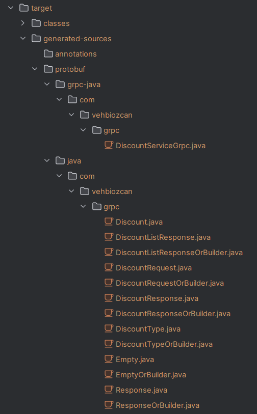

## Uygulama Görüntüleri

### Konsol Görüntüsü

#### Product-Service Konsol Görüntüsü
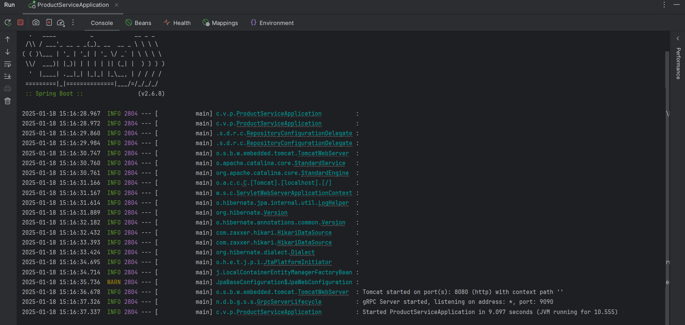

#### Discount-Service Konsol Görüntüsü
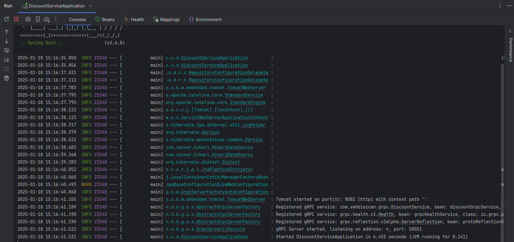


<hr/>

### Postman Görüntüleri

#### getDiscount() Parametreli Metodu çalıştıran Endpoint

Bu endpointe atılan request product servis ile iletişime geçip product servis üzerinden discount servis ile gRPC üzerinden iletişime geçer verilen product id ve code'a göre, sonuç olarak eski fiyat, indirimli fiyat ve code bilgisini geriye döner

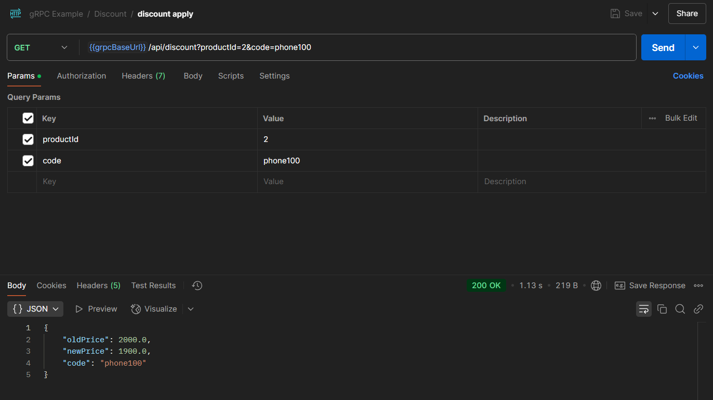

#### getAllDiscount() Parametresiz Metodu çalıştıran Endpoint

Bu endpointe atılan request product servis ile iletişime geçip product servis üzerinden discount servis ile gRPC üzerinden iletişime geçer parametresiz bir istek atılır, sonuç olarak tüm discount türlerinin bilgisini liste olarak geriye döner.

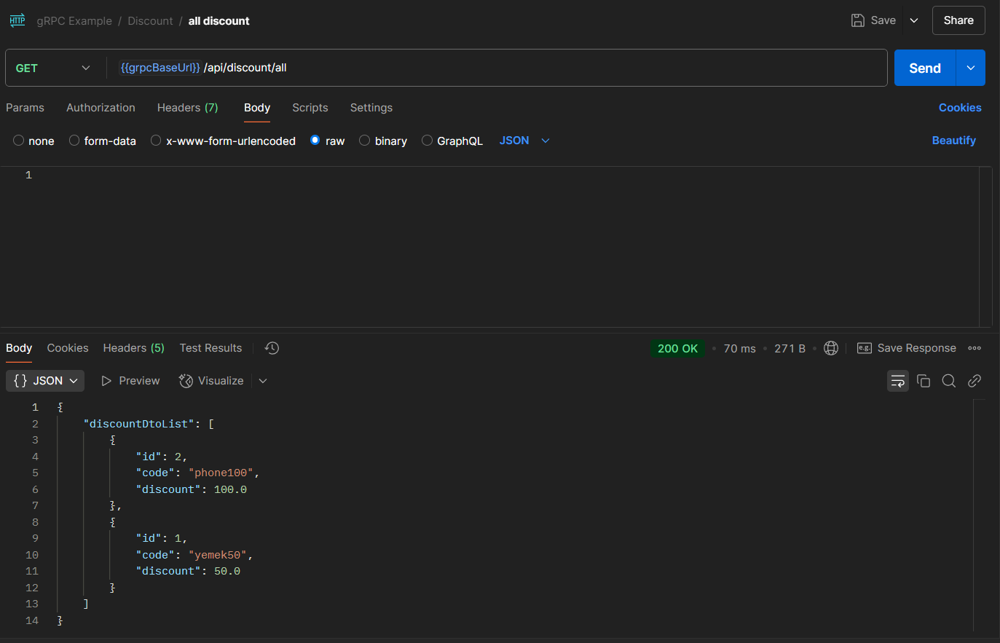


<hr/>

### Swagger Görüntüleri

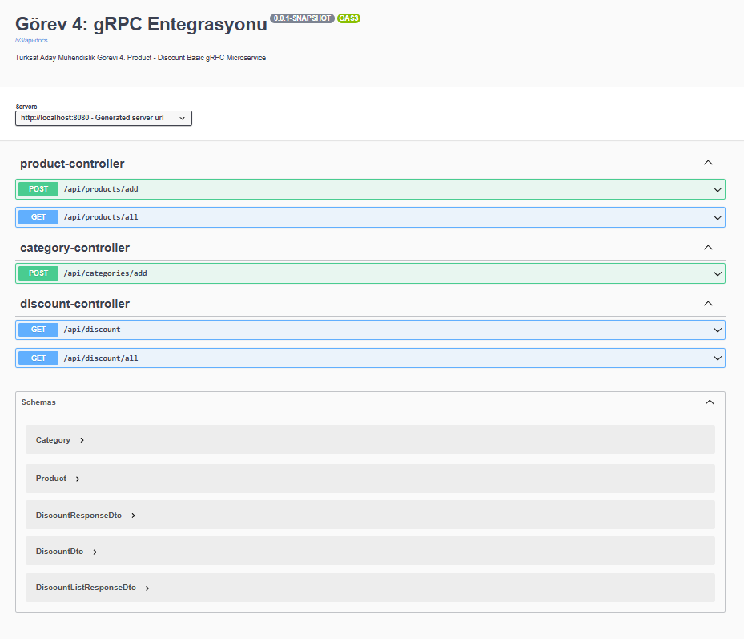

#### Get Endpoint

Tüm ürünleri getirir
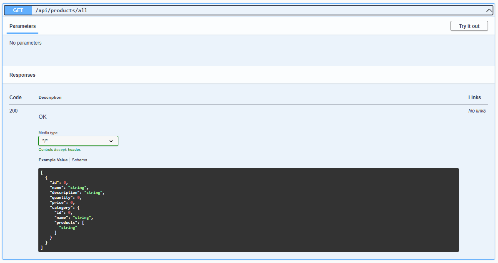

#### Post Endpointleri

Ürün Ekler
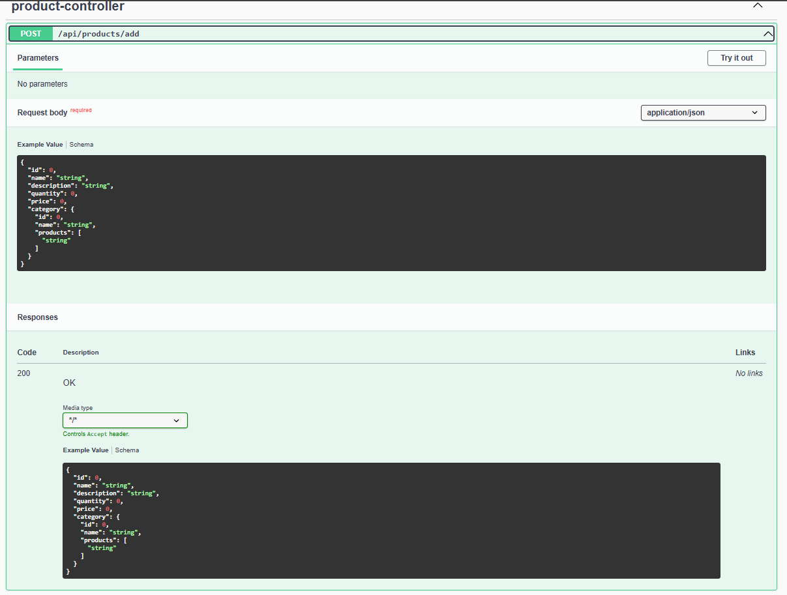

Kategori ekler
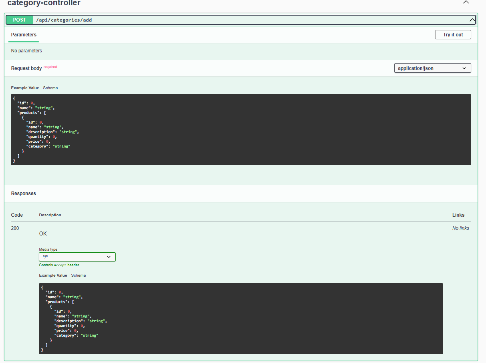

#### gRPC Kullanan Endpointler

İndirim uygular (gRPC kullanır)
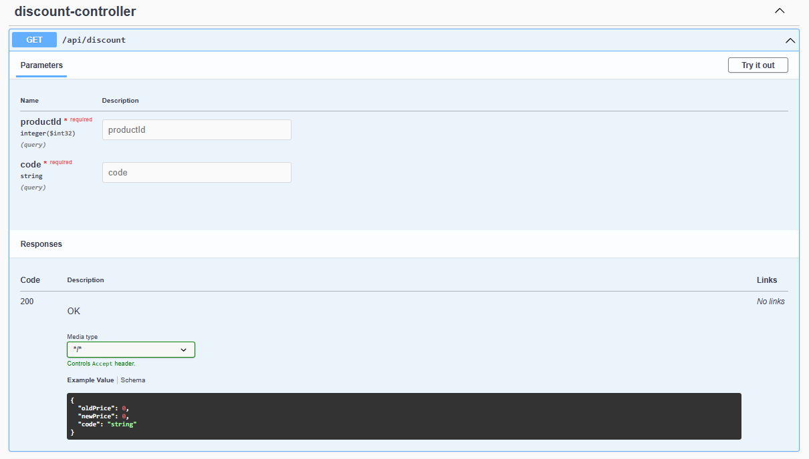

Tüm discount türlerini getirir (gRPC kullanır)
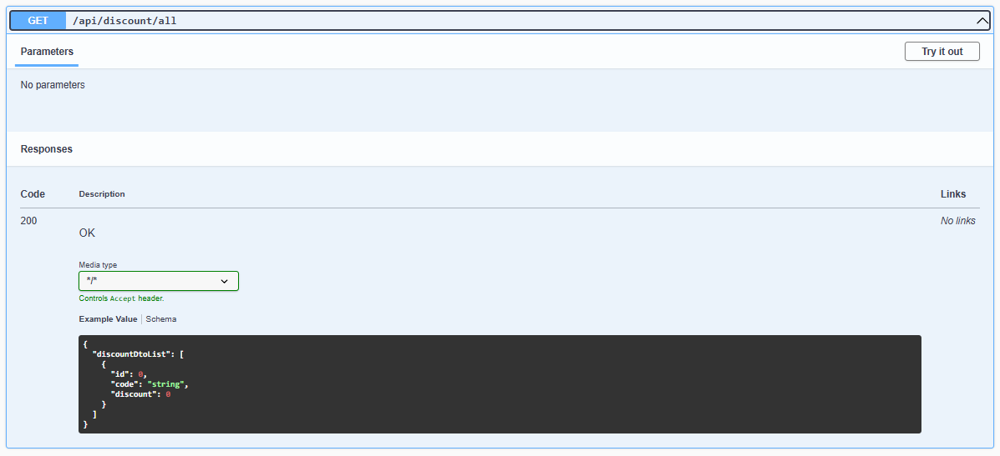

## Kaynaklar

- [Berat Yesbek YouTube](https://www.youtube.com/watch?v=w0jvG_Mvln4&list=PL3ZqtT5kdwSH5vKiJbMPX0IM5ffl_WPCt&index=1)
- [Gençay Yıldız](https://www.gencayyildiz.com/blog/grpc-nedir-ne-amacla-ve-nasil-kullanilir/)
- [gRPC.io](https://grpc.io/docs/what-is-grpc/)
- [Medium 1 (Serhat Ataş)](https://medium.com/@serhatats/grpc-nedir-f96a341953b2)
- [Medium 2 (Serhat Ataş)](https://medium.com/@serhatats/spring-boot-ile-grpc-projesi-a6ccf60b6470)
- [Infracloud](https://www.infracloud.io/blogs/understanding-grpc-concepts-best-practices/)
- [gRPC Spring Boot Starter](https://github.com/yidongnan/grpc-spring-boot-starter)

